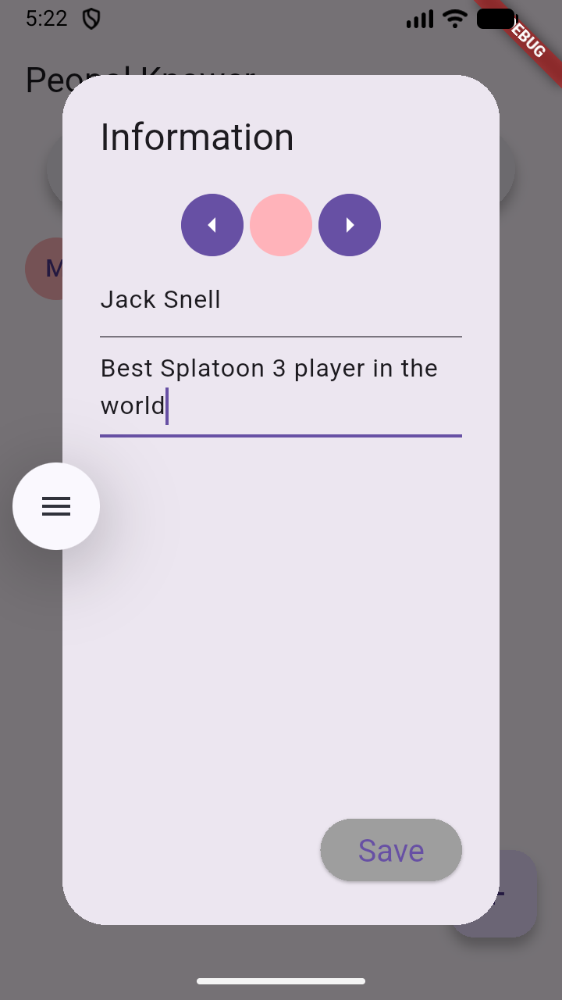
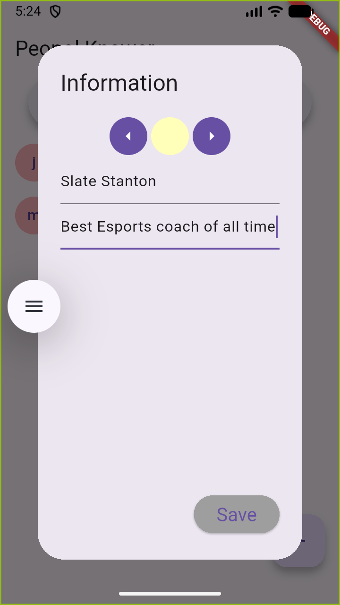
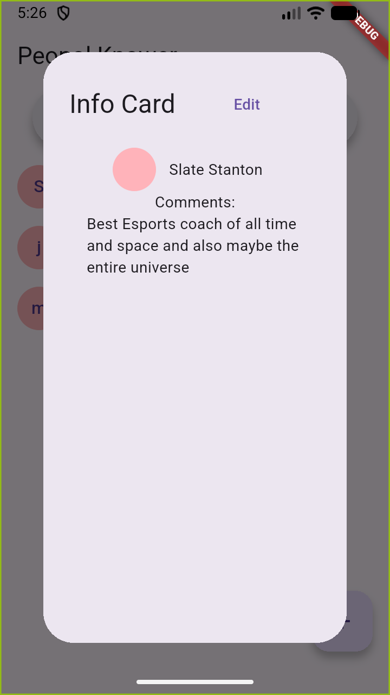
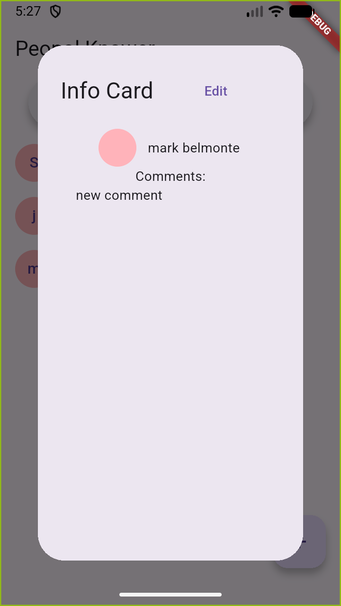
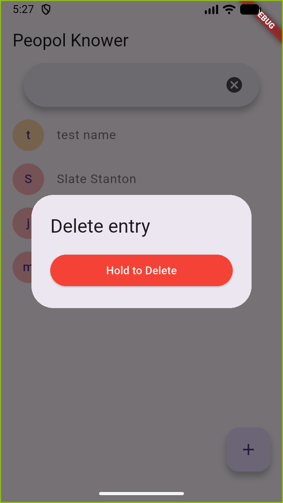

# Peopol Knower

This is for people who want a quick app to hold information regarding connections in general (suppose someone doesn't have a phone number)
It allows custom comments for whatever information might be needed

Built specifically to be an efficient list of contact info instead of bumbling around a notes app or phone contacts with people who don't ever use their phone

(Future updates may include adding filters and connections to better see how the people you know are *connected* as well as a separate graph view to visualize those connections)

